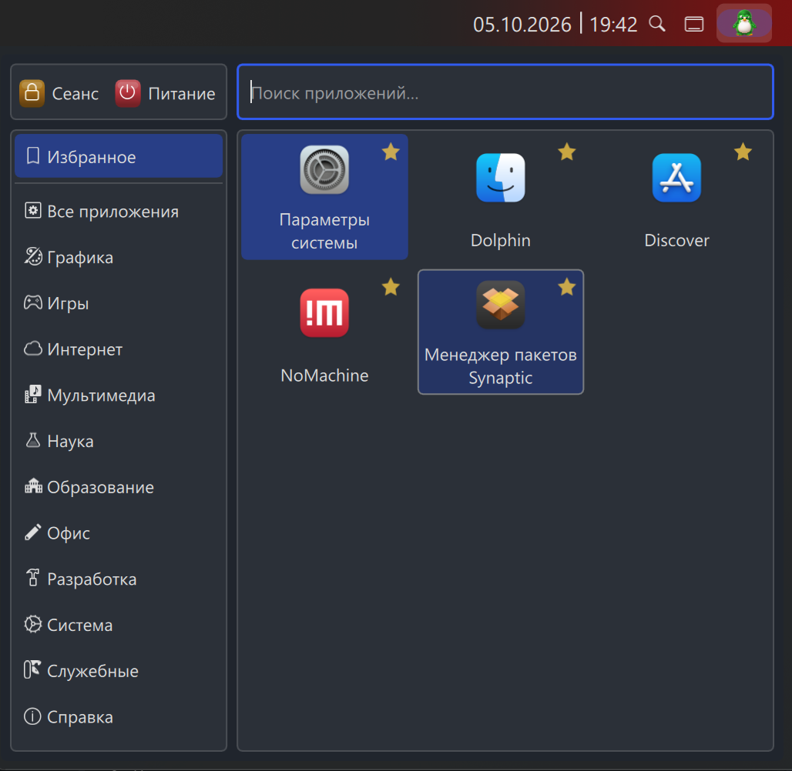
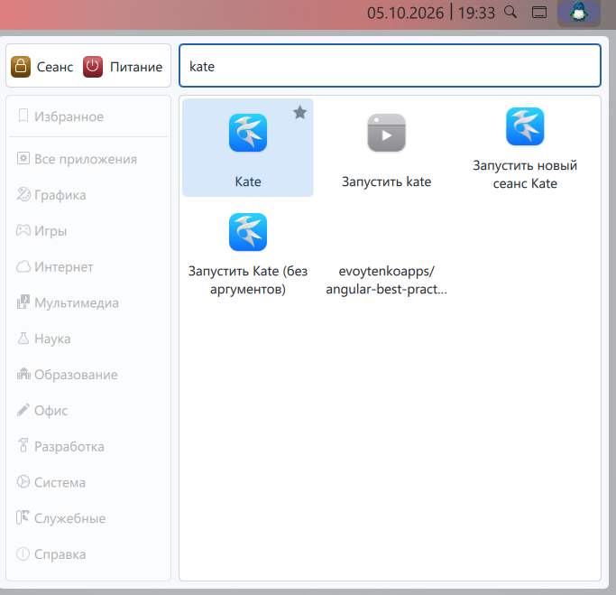

# Меню Apophuy

[English version](README.md)

Меню Apophuy — компактное и предсказуемое меню запуска приложений для KDE Plasma 6.
Оно использует штатные модели Plasma для приложений, избранного, поиска и
сессионных действий, сохраняя интерфейс намеренно простым.

Первый релиз предназначен для Debian 13 (Trixie), KDE Plasma 6.3, Qt 6.8,
KDE Frameworks 6.13 и Wayland.

## Скриншоты





## Возможности

- Категории приложений Plasma и штатный запуск приложений
- Отдельное для каждого экземпляра избранное с явными действиями добавления и удаления
- Поиск на основе KRunner с навигацией и запуском с клавиатуры
- Сгруппированные нативные меню «Сеанс» и «Питание»
- Режимы «Как в системе», светлая и тёмная темы
- Оригинальный и плоский значки пингвина Apophuy с цветовыми пресетами
- Английский и русский интерфейсы
- Навигация с клавиатуры, видимый фокус и поддержка HiDPI

Скриншоты релиза созданы пользователем в реальной панели Plasma на Wayland.
Полный список и критерии приведены в
[`docs/release-screenshots.md`](docs/release-screenshots.md).

## Установка

Рабочую копию можно установить для текущего пользователя без `root`:

```sh
./scripts/install.sh
```

Либо установите релизный архив:

```sh
kpackagetool6 --type Plasma/Applet --install apophuy-application-launcher-0.1.1.plasmoid
```

После установки войдите в режим редактирования панели Plasma, выберите
**Добавить виджеты** и добавьте **Меню Apophuy**. Для
обновления установленной версии замените `--install` на `--upgrade`.

## Удаление

Из рабочей копии:

```sh
./scripts/uninstall.sh
```

Или напрямую:

```sh
kpackagetool6 --type Plasma/Applet --remove io.github.apophuy.applicationlauncher
```

Удаление виджета с панели не удаляет его пакет. После установки или удаления
обычно не требуется выходить из сеанса, но для обновления списка виджетов Plasma
иногда нужно закрыть и снова открыть его.

## Сборка и проверка

Для разработки требуются QML-инструменты Qt 6, `kpackagetool6`, gettext,
`xmllint`, `zip`, `unzip` и `sha256sum`. Запустите статические проверки и
runtime-тесты моделей Plasma:

```sh
./scripts/check.sh
./scripts/test-runtime.sh
```

Версионный `.plasmoid`-архив и его SHA-256 checksum создаются в `dist/`:

```sh
./scripts/package-release.sh
```

Runtime-набор должен запускаться из активного пользовательского сеанса Plasma.
Поведение popup при потере фокуса и клике вне виджета необходимо проверять в
реальной панели Wayland: оконные инструменты Plasma не могут полностью
воспроизвести этот контракт. Полная матрица и результаты — в
[`docs/testing.md`](docs/testing.md).

## Архитектура и совместимость

Apophuy полностью реализован на QML и не сканирует desktop-файлы, не создаёт
собственную базу приложений. Он намеренно использует приватные QML-модели
Kicker из Plasma: в установленной в Debian 13 Plasma нет эквивалентной
публичной модели launcher. Эта точечная зависимость документирована в
[`docs/architecture.md`](docs/architecture.md) и должна перепроверяться после
каждого обновления Plasma.

## Лицензия

Copyright © 2026 Apophuy. Проект распространяется по GNU General Public
License, версии 3 или любой более поздней. См. [`LICENSE`](LICENSE).
